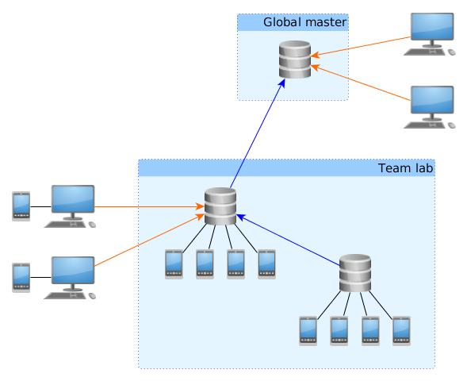

.. _broker-network-allocation:

Networked Allocation
====================

This document describes how the broker supports sharing of resources within a
network of brokers, and how allocation against this combined pool work.

Overview
--------
The support for multiple brokers is divided into two separate solutions that
may be combined to form a network:

* **Forwarding:** A broker that is unable to satisfy a resource request locally
  may forward the request to another broker.

* **Sharing:** A broker may dedicate all of its resources to a master broker.
  The master may then perform allocation on the assumption that it has perfect
  information about the sharing broker's resources.

*Blue lines indicate sharing. Orange lines indicate forwarding. Clients may
forward to any selected broker in the network. Network loops are not permitted.*

Terminology
-----------
* **Allocator:** An implementation detail of the broker. Allocators keep track
  of allocations per client and per broker.

* **Client:** Any program using a ``RemoteBroker`` instance to connect to a
  broker.

* **Leaf:** A broker that performs a local allocation. The broker may also have
  slaves, but at the moment of allocation is is considered a leaf in a series
  of connected brokers.

* **Master:** A broker that is being shared to by other brokers.

* **RemoteBroker:** An implementation detail of the broker. Clients use this
  class to connect to the broker process.

* **Session:** A separate process created by a broker to handle interaction
  with resources allocated by a client.

* **Slave:** A broker that shares to another broker.

* **Upstream:** A master broker may be a slave to yet another master broker.
  The "other" master broker is considered to be "upstream".

Note that a broker can be *master* and *slave* at the same time in setups where
sharing is done in multiple steps. E.g. the middle broker in the illustration in
the *Overview*.

Scenarios
---------
A series of execution traces of increasing complexity are presented in this
section. Race conditions between competing clients are not accounted for in
detail but are implicitly covered by the failure scenarios. Race conditions
are covered in more details under *Notes on Concurrency*.

For ease of comparison with networked scenarios, the scenarios for local
allocation are included.

.. Note:: Some functions are partially implemented on the client side. This is
    sometimes needed to implement good error handling on the client side, or to
    hide complexity that the client program should normally not care about. In
    particular note the differences between ``Broker.get()`` (server side) and
    ``RemoteBroker.get()`` (client side).

Local Success
^^^^^^^^^^^^^
1. Client creates a ``RemoteBroker`` instance and connects to the local broker
   by executing e.g.::

       from ave.broker import Broker
       b   = Broker()
       h,w = b.get({'type':'handset'}, {'type':'workspace'})

   *Note that the* ``import`` *statement actually imports* ``RemoteBroker``
   *and that this is hidden from the client, which normally does not need to
   care about the distinction.*

2. ``RemoteBroker.get()`` creates an RPC message with the allocation request
   and sends it to the server, then waits for a response.

3. The server creates a session for the client if it didn't already have one.
   See the source code implementations of ``Broker.new_connection()`` and
   ``Broker.new_session()``. A randomized authentication key is generated that
   is needed to connect to the session.

4. ``Broker.get()`` validates the requested profiles and fills in default
   attributes for certain equipment types unless the client explicitly asked
   for "odd" profiles (e.g. an offline handset).

5. ``Broker.get()`` calls ``LocalAllocator.get_resources()`` (the allocator
   for local equipment always sorts before allocators for sharing brokers).
   This will only succeed if all profiles can be satisfied. The example above
   includes a workspace, which is created after "real" equipment has been
   allocated. Each allocated profile is added to the session by a call to
   ``Session.add_resource()``.

6. ``Session.add_resource()`` creates an instance of the "real" equipment
   support class. Until this point the broker has only dealt in profiles. The
   creation is deferred to the session to avoid stalls in the broker main loop
   in case the equipment support is buggy or performs long running operations
   in its constructor (please don't do that).

7. ``Broker.get()`` sends the allocation details to its master if it is set up
   for sharing. This is done from a separate process to avoid stalling the main
   loop if the master broker is slow to respond. It then returns the allocated
   profiles in an RPC response message to the client.

8. ``RemoteBroker.get_resources_raw()`` receives the allocated profiles and
   creates ``self.session = RemoteSession`` to represent the session that the
   broker has created. It then uses it to finish the allocation by demanding
   that the session confirms the allocations.

9. ``Session.get_resources()`` can confirm the allocations immediately because
   they were made locally. It returns it's own network address (hostname and
   port number) and the profiles to the client.

10. ``RemoteBroker.get()`` creates a ``Remote<ResourceType>`` instance for each
    allocated profile. These know the network address of each resource and
    implement the client side of AVE's RPC model, to support method calls made
    by the client. The resource objects are returned to the program that
    implements the client.

Local Failure
^^^^^^^^^^^^^
Steps 1-4 are the same as for a successful local allocation.

5. ``LocalAllocator.get_resources()`` raises either ``Busy`` (if all matching
   resources are already allocated) or ``NoSuch`` if no resource at all matches
   a requested profile.

6. ``Broker.get()`` has no more allocators to try the allocation (no other
   broker is sharing with it). It reclaims all previous allocations made by
   the client (by closing its session) and raises the allocator's exception
   to the client.

7. ``RemoteBroker.get_resources_raw()`` recreates the exception type and raises
   it to the caller (the client program).

8. Any further calls through the ``RemoteBroker`` instance will raise "session
   closed" exceptions because the client's session has been destroyed. This
   forces the client to start over.

Forward Success
^^^^^^^^^^^^^^^
Forward allocation always starts with a failed local one. Steps 1-5 are the same
as for a failed local allocation.

6. ``Broker.get()`` has no more allocators to try. However it has a forwarding
   rule in its configuration. It tentatively adds the requested profiles to
   the session as a "deferred allocation". It then returns the profiles and
   the session's network address to the client.

7. The session does not try to satisfy the deferred allocation immediately.
   Instead it waits for the client to connect.

8. Exactly the same as for a successful local allocation.

9. ``Session.get_resources()`` cannot confirm the allocations immediately (they
   have not even been attempted yet). It creates a ``RemoteBroker`` instance
   against the broker mentioned in the forwarding rule and acts as a client on
   behalf of the real client: It calls ``RemoteBroker.get_resources_raw()``
   with the requested profiles. This triggers an allocation attempt on another
   broker (may be local, forward or share as described in this document).
   Resource profiles and session details are eventually returned. Meanwhile the
   real client is blocking.

10. The session adds the allocated profiles to its internal state and remembers
    which remote broker performed the allocation. The ``RemoteBroker`` instance
    must be kept for the duration of the session since destroying it will cause
    a resource reclamation in the broker that actually allocated the resource.

11. Exactly like step 10 for local success, but the network addresses for the
    resources will point to another machine.

Forward Failure
^^^^^^^^^^^^^^^
Steps 1-8 are the same as for a successful forward allocation.

9. The session's call to ``RemoteBroker.get_resources_raw()`` fails and the
   session merely re-raises the exception to the client. It then shuts itself
   down.

10. The broker main loop detects that the session terminated and reclaims all
    resources held by the session.

11. Any remote brokers that had already allocated resources for the client's
    session when the last allocation failed will notice that the session drops
    its client (as it shuts itself down). This causes them to reclaim *their*
    resources and terminate sessions.

Final steps are the same as 7-8 for local failed allocations.

Share Success
^^^^^^^^^^^^^
Share allocations always starts with a failed one. Steps 1-5 are the same as for
a failed local allocation.

6. ``Broker.get()`` retries the allocators for all the slaves that are sharing
   with it. It keeps track of the "best" error seen among the allocators.

7. ``ShareAllocator.get_resources()`` assumes that equipment and allocation
   information that was received from a slave is correct and performs the
   allocation almost exactly like ``LocalAllocator.get_resources()``: It does
   not create workspaces and it ends by raising ``Shared``.

8. ``Broker.get()`` sees a ``Shared`` exception, which is better than ``Busy``
   and ``NoSuch``. It means the allocation should succeed if it is retried at
   the broker that is associated with the allocator.

9. ``Broker.get()`` tentatively adds the requested profiles to the session as
   a deferred allocation. It then breaks the allocator loop and returns the
   profiles and the session's network address to the client.

Final steps are the same as steps 7-11 for successful forward allocations.

Share Failure
^^^^^^^^^^^^^
Steps 1-5 are the same as for a failed local allocation.

6. ``Broker.get()`` has no more allocators to try. It also has no forwarding
   rule (support for concurrent sharing and forwarding is not implemented). It
   now

   * reclaims all previous local allocations made by the client,
   * "reclaims" share allocations by completely deleting the resources from
     its internal state, (See the *Notes on Concurrency*)
   * closes the client's session, and
   * raises the best allocation exception it has seen to the client (``Busy``
     or ``NoSuch``).

7. ``RemoteBroker.get_resources_raw()`` recreates the exception type and raises
   it to the caller (the client program).

8. Any further calls through the ``RemoteBroker`` instance will raise "session
   closed" exceptions because the client's session has been destroyed. This
   forces the client to start over.

9. If the session had successfully allocated resources at other brokers (see
   step 9-10 for successful forward allocation), those brokers will now notice
   client disconnections and close their sessions.

Notes on Workspaces
^^^^^^^^^^^^^^^^^^^
Unlike "real" equipment, workspaces can be created almost without limit, so a
broker can simply make one if the allocation request matches the profile seen
in ``.ave/config/workspace.json``. There are also some special considerations
for sharing brokers:

* Any created workspace must be published to the master so that a client can
  allocate the same workspace multiple times. This can be used by the client
  to force multiple allocations to the same broker, which is actually needed
  sometimes.

* The base profile determined by ``.ave/config/workspace.json`` is published
  together with real equipment profiles to a master so that the master broker
  can know if an allocation attempt will be successful on the share.

* Workspaces are deleted from the file system when the session that holds the
  ``Workspace`` object is shut down. I.e. the broker does not support post
  mortem analysis of content in workspaces. Clients should upload important
  files to *Flocker* before disconnecting from the broker.

Notes on Concurrency
^^^^^^^^^^^^^^^^^^^^
* The rationale for many of the design decisions described in this document
  is to avoid stalling the broker's main loop. The only call clients can make
  to the broker's main loop is ``get()``. Everything else is handled in an out-\
  of-band manner by the client's session. To the client it's all the same.
  Impossible requests eventually time out or result in some other error
  condition, but the broker is free to handle other requests while this is
  happening. All administrative methods implemented on the broker's main loop
  have predictable (very short) completion times.

* The broker implements a decentralized model. As can be seen in this document,
  this yields a complicated design compared to a centralized model. The reason
  to go with decentralization is primarily to gain flexibility. Anyone can set
  up a lab without lots of organizational synchronization. It also means that
  existing labs can be brought together later, under a common master. Firewalls
  permitting, it is possible for two fully separate companies to share equipment
  with each other.

* When a share allocation is successful, the changes in allocation tables are
  not immediately dumped and sent to an upstream master. This is not needed
  because

   1. The upstream master has already tentatively booked the allocation as
      successful (if the attempt came from that master).
   2. The leaf broker will dump and send its allocation tables when its local
      allocation succeeds. This information is recursively resent by sharing
      brokers upstream.

* It is possible for a master to be presented with conflicting allocation state
  for a slave. This may be the case if the slave reclaims resources before the
  master has even noticed that the client has disconnected. In such cases the
  master must choose to believe that the slave's resources are still allocated.

* When allocating through a chain of brokers, the return path of the request
  from the leaf does not pass through the intermediate *brokers* but is passed
  entirely through the involved *sessions* at each broker. Once the RPC keys
  from the leaf are delivered to the client, further calls to the resources go
  straight to the session that actually holds the resources.

* Shares that disconnect from a master broker have their allocators deleted
  automatically. No state is kept. *This does not affect sessions!* The master
  can no longer assert the existence of the equipment in the slave but it need
  not bother because any problem will be handled by the master's session. At
  the same time, the slave does not disconnect clients that allocated through
  the master. Instead it allows sessions to complete. Because the client has a
  direct connection to its session on the slave, it does not notice that the
  slave disconnected from the master. The purpose of this feature is to let
  lab owners disconnect slaves for planned downtime without affecting running
  tests. When the last client has disconnected, the slave can be shut down.

* When resources from a slave are reclaimed by a master, the master does not
  mark the resources as available. Instead it deletes all knowledge about the
  resources. This is needed for two reasons:

  1. The slave may no longer be sharing. See previous note.
  2. The next master allocation might pick the reclaimed resource. If the slave
     has been slow to reclaim the previous client's allocations, this might lead
     to an (avoidable) failure when the master's new session tries to confirm
     the second allocation.

  The notification mechanism eventually propagates the state changes in the leaf
  so that the master may allocate from the slave again.

* Notifying a master about resources and allocations must not be able to stall
  the slave's main loop. E.g. if the master is slow to respond. To avoid stalls
  all outgoing notifications are handled by a separate process implemented in
  the ``Notifier`` class. Calls to the notifier are done with the ``__async__``
  flag to make sure the broker does not even wait for the message to reach the
  notifier.

* As discussed, a broker detects the disconnect of a client (which may be a
  session acting on behalf of a client). But the session also detects if the
  session created by the remote broker disconnects and, if so, shuts itself
  down. This is needed to propagate reclamation across the network.

* The rationale to close sessions on the first failed allocation attempt is
  motivated by this deadlock situation:

  1. Client A successfully allocates the first handset.
  2. Client B successfully allocates the second handset.
  3. Client A fails a second allocation attempt for a companion handset.
  4. Client B fails a second allocation attempt for a companion handset.

  .. figure:: deadlock.jpg
     :align: center

  If there are no more handsets in the network and clients are allowed to retry
  secondary allocations while keeping successful ones, it should be obvious that
  both clients in the example will loop forever.

* When resources are freed, it takes some time for a share to re-add them to
  a master. Two jobs that execute right after each other, against the master,
  may not be able to get the exact same resource without delaying the second
  job a little.

* Clients may request directly from a slave, without going through a master.
  The slave will inform the master about changes in allocations, but before
  this happens a client on the master may try to allocate the *same* equipment.
  The master still thinks the resource is available in the slave and hands off
  the request to a session. The session then fails the allocation because the
  first client has already allocated the resource (at just the wrong moment).
  Fixing this problem is not desirable (the system would have to be centralized)
  and is not feasible (read up on message passing theory if you do not believe
  this). It is better to follow the convention that clients should reschedule
  their execution on the assumption that all needed resources eventually become
  available. This works because, in practice, the clients are are queued up by
  schedulers and those queues have finite lengths.

* A client that first allocates a resource, then yields it and immediately
  tries to allocate it again is likely to fail the second allocation. This may
  happen because it can take some time (fractions of seconds) for the equipment
  to be noted as available by the broker. Clients should follow the convention
  of performing all resource allocations as early as possible, before starting
  any costly work.

Miscellaneous Notes
^^^^^^^^^^^^^^^^^^^
* ``Broker`` RPC methods that provide control over sharing are protected with
  the ``share`` key from ``.ave/config/authkeys.json``. This is intended to
  protect a master against accidental sharing from nodes that are not under
  proper control by a lab owner. I.e. the share must know the password set on
  the master to be able to share equipment. As noted elsewhere, *the authkeys
  mechanism is not a security feature*.

* The system of tracking the TCP connections between brokers and clients may
  result in high numbers of open, but mostly silent, client connections if the
  broker network is large. This is a necessary evil to be able to track the
  liveness of all peers involved in a session but is not expected to cause any
  performance issues. A regular Linux server box should be able to handle at
  least 100'000 open but silent TCP connections without much of a performance
  impact. This is very likely far more than will ever be needed by a real world
  broker network. Real world performance monitoring will have to conclude if
  this is a reasonable approach. Otherwise the number of connections can be
  reduced by shortcutting the connections between involved peers to exclude
  brokers that mediated a request but did not provide any actual resources.

Known Limitations
-----------------
* Forwarded requests are not tagged with their originating broker. Two brokers
  that are set up to forward to each other may cause infinite request loops.
  Obviously this hole needs to be closed.

* The protection against resource deadlock, as described in *Notes on
  Concurrency*, can be bypassed by two cooperating clients. Because the same
  program can create multiple ``RemoteBroker`` instances, an unlimited number
  of clients created by the same program can be used to starve the system of
  all resources. Note that the only full protection against this is to require
  real user authentication *and* limit client connections per user to one (1).
  This is too severe for practical purposes where e.g. a scheduler must be
  able to run many jobs concurrently, using the same user credentials for all
  jobs. However, it is probably a good idea if opening internal labs to the
  public...

* The RPC ``__async__`` flag has limited effect if the underlying connection
  has not been created yet. This should be fixed in ``ave/common``,
  the broker implementation must be careful to always initiate outgoing client
  connections in time limited manners.
