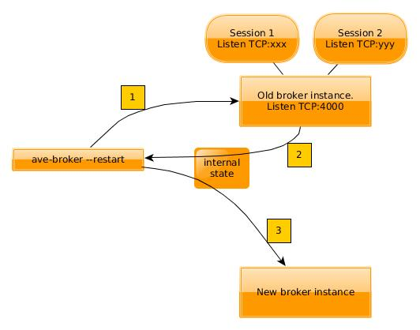
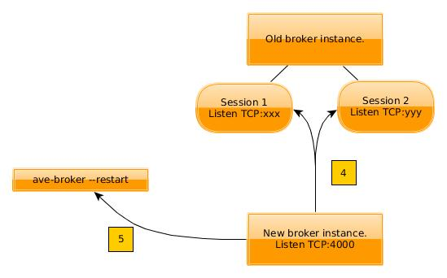
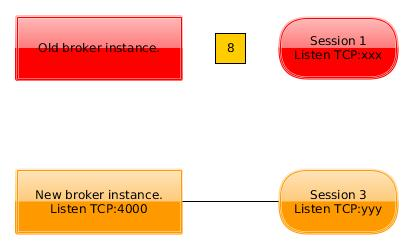

Restart
=======

This document describes in some detail how the broker restart is implemented.

Overview
^^^^^^^^
The lab owner calls ``ave-broker --restart`` to perform a restart. This spawns
a new broker instance that will cooperate with the old instance until the old
instance can be terminated:

1. The executable ``ave-broker --restart`` looks for an already running broker
   and tells it to initiate a handover.
2. The running instance returns a dump of its internal state. It no longer
   accepts new clients and no longer permits new allocations. Existing clients
   are *not* evicted.
3. The executable starts the replacement broker using the exported state.

4. The new instance uses TCP socket file descriptors passed in the dumped state
   to connect to the sessions it inherits from the old instance. Both instances
   can now track the liveness of a session through a single TCP connection held
   by both brokers (there is no traffic on this connection).
5. The new instance starts accepting connections on the public port number and
   returns control to the executable which then exits.

.. figure:: restart3.jpg
   :align: center

6. When an old session dies, the single TCP connection shared by both brokers
   is closed. This informs the new broker that it should reclaim the equipment
   that was originally allocated by the old broker. The old broker takes no
   action.
7. Sessions for clients that connected after the restart are only visible to
   the new broker.

8. Eventually the last session from the old broker terminates. The old broker
   is then also terminated.

.. rubric:: Complications

* The old broker cannot allocate equipment efter the restart. If an old client
  tries to do so it will get a ``Restarting`` exception. Test jobs should make
  all of their allocations as early as possible to minimize lost effort in the
  rare case that they hit this race condition.
* If the old broker was sharing resources to a master broker, it will have to
  stop doing so and let the new broker start the sharing again.
* If the old broker was a master with connected shares, it will have to drop
  the shares and let them try to reconnect. The new broker will accept those
  connections.
* The new broker cannot ``os.wait()`` on the processes for old sessions when
  they are terminated. The old broker is the only process that can do so
  (without daemonizing the sessions).

Terminology
-----------
The rest of the document will use these terms:

* **Handover:** A service that was running normally but has entered the state
  where it no longer accepts new clients. It has handed over its internal
  state to its replacement.

* **Takeover:** A service that has consumed the internal state of a handover
  and acts in the handover's stead.

Implementation Details
----------------------

``Broker`` class
^^^^^^^^^^^^^^^^
:module: ave/broker

* ``make_tempdir()``: The handover and takeover need a safe place to create
  the UNIX domain socket used to transfer file descriptors.
* ``adopt_sessions()``: Used by the takeover to create ``AdoptedSession``
  instances to represent sessions that still linger in a handover. The actual
  connection over the UNIX domain socket to the handover is made here.
* ``drop_all_shares()``: Only used by handover masters in a share/master
  relationship. The shares are disconnected on the assumption that they will
  try to reconnect until they succeed. When they do, they will be connected
  to the takeover, which then receives the shared resources.
* ``serialize()``: Creates a JSON encoded state representation of all sessions
  that have made local allocations. The takeover will consume this state to
  figure out which resources are allocated by lingering sessions in the
  handover.
* ``begin_handover()``: Causes a handover to stop listening for new connections,
  drop all shares (if any), stop sharing (if there is a master), refuse further
  allocation attempts in lingering sessions, and create a listening UNIX domain
  socket that a takeover will connect to (see ``adopt_sessions()`` above).
* ``end_handover()``: Waits for a takeover to connect to the UNIX domain socket,
  then uses an ``FdTx`` object to transfer file descriptors for the sessions'
  TCP connections to the takeover. Finally it either calls ``shutdown()`` (if
  no lingering sessions remain) or enters a state where the handover only waits
  for lingering sessions to terminate.
* ``shutdown(details)``: The ``details`` parameter may hold an exception that
  is passed to any connected clients as a sign-out message.
* ``__init__(..., adoption, fdtx_path, ...)``: The ``adoption`` parameter is
  used to pass a handover's serialized state to the takeover. ``fdtx_path`` is
  a file system path to a UNIX domain socket that will be used by the handover
  to pass file descriptors, using an ``FdTx`` object.

``Restarting`` class
^^^^^^^^^^^^^^^^^^^^
:module: ave/broker

This exception is thrown at clients that have made at least one allocation
against the original broker and then tries to make more allocations after a
restart. This should be an extremely rare event if test jobs follow this coding
guideline:

 * Make all allocations as early as possible.

It can be handled by the client just like the ``Busy`` exception. I.e. simply
rerun the test job.

``Allocator`` class
^^^^^^^^^^^^^^^^^^^
:module: ave/broker

* ``serialize()``: Used by ``Broker.serialize()``.

``AdoptedSession`` class
^^^^^^^^^^^^^^^^^^^^^^^^
:module: ave/broker

This class is used by a takeover to track lingering sessions in a handover. The
takeover indexes these sessions exactly like it indexes "real" sessions. This
makes it possible for a takeover to become a handover for yet another takeover
(if another restart happens before all lingering sessions have terminated). This
is needed to keep sessions alive over multiple broker restarts.

* ``__init__(pid)``: A takeover must know the PID of an adopted session to be
  able to terminate it forcefully.

* ``terminate()``: Send ``SIGTERM`` to the adopted session. Note that the
  takeover cannot call ``os.wait()`` on the PID and must assume that the
  handover does so (to avoid creating zombies).

``BrokerDaemon`` class
^^^^^^^^^^^^^^^^^^^^^^
:module: ave/broker

* ``postinst``: Run ``ave-broker --restart`` if a broker was already running
  during package installation. Otherwise run ``ave-broker --start``.

``Control`` class
^^^^^^^^^^^^^^^^^
:module: ave/common

* ``stop_listening()``: Close the listening socket so that new clients cannot
  be admitted.
* ``write_exit_message(connection, details)``: Serializes an exception (the
  ``details`` parameter) and writes it on the passed connection. Only used
  during shutdown to pass a sign-out message to clients before disconnecting
  them.

``FdTx`` class
^^^^^^^^^^^^^^
:module: ave/common

This class is used to transfer file descriptors from one process to another. It
is built on a special feature of UNIX domain sockets that allows the sender to
share the ownership of resources (e.g. file descriptors) with the receiver.

There is no standard wrapper for this functionality in Python 2.6/2.7 (which AVE
uses) so a small native library had to be created and then wrapped using the
Python ``ctypes`` module. The native implementation is found in the directory
``src/libfdtx``.

See regular API documenation for further details.

Future Work
-----------
* It should be possible to use ``FdTx`` to transfer all client connections to
  the takeover, not just the session connections. The clients would then make
  all future RPC calls to the takeover, which would remove the limitation that
  old sessions cannot make new allocations. The main complication is that any
  partially received messages on the connections must also be passed to the
  takeover.
