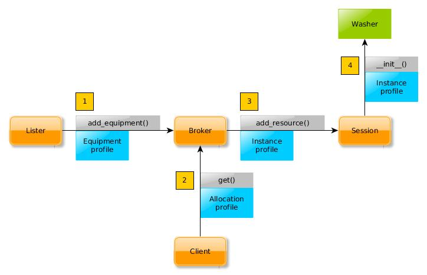

Implement New Equipment Support
===============================

This document describes how to write and integrate new equipment classes into
AVE:

* Requirements on the equipment itself.
* How equipment profiles work and how they are used by the broker.
* Changes to make in the broker.
* What the equipment class' ``__init__(self)`` function must and must not do.
* Requirements on all public equipment API's.
* Recommended way to debug code.
* *udev* event based equipment listers.
* Configuration file based equipment listers.
* How to write tests that demonstrate that the equipment support works.
* Specific broker tests that must pass.
* Specific equipment lister tests that must pass.
* How to write API documentation.

Note that these are generic guidelines. Equipment sometimes has exotic features
or limitations that require more work for full and seamless integration.

Also see the `Structural Guidelines`_ for requirements on the new module's file
and directory structure.

Code examples are given for a hypothetical washing machine device that may be
controlled over a USB connection.

.. _Structural Guidelines: ../governance/structure_guidelines.html

Equipment Requirements
----------------------
Equipment fall into three broad categories:

* USB equipment.
* TCP/IP networked equipment.
* Intrinsic features of the test host.

USB Equipment Serial Numbers
++++++++++++++++++++++++++++
The equipment must have a globally unique serial number (or similar attribute)
that can be read without claiming the device. This is necessary to monitor the
equipment's basic connected/disconnected state in the broker after another
process has claimed the device (i.e. a test job).

You can check if a piece of equipment passes this requirement by inspecting it
with::

    lsusb -v

This lists *all* USB equipment on the host. A SoMC handset entry will look
something like this::

    Bus 002 Device 009: ID 0fce:5189 Sony Ericsson Mobile Communications AB
    Device Descriptor:
      bLength                18
      bDescriptorType         1
      bcdUSB               2.00
      bDeviceClass            0 (Defined at Interface level)
      bDeviceSubClass         0
      bDeviceProtocol         0
      bMaxPacketSize0        64
      idVendor           0x0fce Sony Ericsson Mobile Communications AB
      idProduct          0x5189
      bcdDevice            2.28
      iManufacturer           1 Sony
      iProduct                2 C6503
      iSerial                 3 CB5121X6KM

      # 80 lines of output removed for clarity

The device descriptor field ``iSerial`` is set to ``"CB5121X6KM"``. This field
may be read by any program at any time, without claiming the device.

.. warning:: If the equipment does not expose a unique serial number, then it
   may be very hard or impossible to support more than one device per host
   machine. The equipment vendor can tell you if it uses unique serial numbers.

USB Equipment VID/PID Values
++++++++++++++++++++++++++++
The device descriptor's ``idVendor`` and ``idProduct`` values should identify
the equipment's type. (Other options may exist depending on the equipment. See
``iManufacturer`` and ``iProduct`` in the previous example.) This is normally
not a problem, but some equipment will be based on Arduino boards (or similar)
and have the VID/PID of that product rather than the fully developed equipment.
In such cases it may be very difficult to tell apart two units that are based
on the same development board.

TCP/IP Equipment
++++++++++++++++
An implementation *may* perform very limited network host/port scans to detect
this kind of equipment. However, it may be easier and safer to just record the
identity statically in a configuration file under ``.ave/config``. Networked
equipment has its own set of problems because they are normally not allowed on
the common intranet and must be walled off in special lab networks.

The equipment host normally runs some sort of server software that came with
the equipment. It is very valuable if this server can answer questions about
the current state of the equipment, without claiming it for the caller. This
can then be used to improve the equipment listing in the broker. Often this
kind of equipment can be used manually and the broker needs a way to determine
this before allocating the equipment to a test job.

.. rubric:: Example

The Spirent GPS simulator is handled this way. The lab owner records the host
name of the simulator host in ``.ave/config/spirent.json``. The equipment is
listed based on that and a globally unique identifier (also selected by the lab
owner).

The equipment host runs a server called *TestDrive* that controls the simulator.
This server can *not* answer questions about equipment state without claiming
the equipment for the caller. This has negative consequences:

* Any ongoing manual use is evicted. The user looses all his work.
* The broker must assume that the equipment is never busy with manual work
  (obviously not true).
* If the lab owner disconnects the network cable before running manual tests,
  it just looks like a network configuration error to the broker.

Of course this simulator is so valuable that it is supported anyway, but with
limitations on use. A *TestDrive* host that is linked into a DUST lab can never
be used for manual work. Conversely a host that is used for manual work cannot
be linked into a DUST lab.

Intrinsic Host Features
+++++++++++++++++++++++
Examples:

* The workspace resource is used to allocate private work directories to jobs,
  but there are no limitations on how many can be allocated. Instead the
  allocation record is needed to automatically delete the work directory when
  the job exits.
* Some host computations may be so CPU intensive that the API must be wrapped
  in a resource that can only be used after allocation. This lets the broker
  limit the number of instances. Computer vision analysis of high speed and/or
  high resolution video falls into this category.
* The WLAN support in a laptop could be considered a broker resource that only
  one job at a time can hold.

Implementing listers for this kind of resource needs special solutions. E.g.
the broker does not list a workspace until it has been allocated/created. If
a job asks for a workspace that already exists, the broker will check that the
session actually owns the wanted workspace. A built in WLAN interface would
have to be listed based on ``ifconfig`` output (or similar) rather than USB
device descriptors (which can be used for WLAN dongles).

Equipment Profiles
------------------
The broker deals only in resource profiles and has very little other knowledge
about the equipment. All profiles must tell the broker *what* it is, which *one*
it is (even when there can only be one device per host) and if the equipment is
currently connected.

The minimum profile for the hypothetical USB ``Washer`` equipment could look like
this::

    {
        "type"       : "washer",
        "uid"        : "washer-1",
        "power_state": "online"
    }

Profiles may reveal other information about the equipment by adding more fields.

The profile class must inherit from ``ave.profile.Profile`` and implement this
API:

.. code-block:: python

    from ave.profile import Profile

    class WasherProfile(Profile):

        def __init__(self, values):
            if type(values) != dict or 'type' not in profile:
                raise Exception('invalid profile: %s' % values)
            if values['type'] != 'washer':
                raise Exception('not a washer profile: %s' % values)
            if ('uid' not in values
            or  type(values['uid']) not in [str,unicode]):
                raise Exception('invalid washer profile: %s' % values)
            Profile.__init__(self, values)

        def __hash__(self):
            return hash(self['uid'])

        def __eq__(self, other):
            return self['uid'] == other['uid']

        def __ne__(self, other):
            return not self.__eq__(other)

        def minimize(self, profile=None):
            # mandatory fields:
            r = {
                'type' : 'washer',
                'uid'  : self['uid']
            }
            # allocation profile fields:
            if profile:
                r.update(profile)
            return HandsetProfile(r)

        def match(self, profile):
            Profile.match(self, profile)

**Notes**

* ``Profile`` is a subclass of ``dict`` and implements all the same methods.
  This is why attributes can be accessed as ``self["<attribute>"]``.
* ``__hash__()``, ``__eq__()`` and ``__ne__()`` let the broker use the profile
  as an index into hash tables.
* ``minimize()`` is used by the broker to reduce the equipment profile to
  only contain mandatory fields and the fields that were included in an
  allocation profile.
* ``minimize()`` may include more mandatory fields if this is required for
  correct initialization of the equipment.
* The default implementation of ``match()`` simply compares attribues. A
  subclass may implement more sophisticated schemes that e.g. check a wanted
  value against a list of possible values that the equipment supports.

Brokers and Profiles
++++++++++++++++++++
When a client lists equipment, it passes a profile to match (the allocation
profile) and the broker uses ``match()`` on all profiles it has received from
any equipment lister. The returned result is a list of full profiles (not
minimized).

.. figure:: profile_1.jpg
   :align: center

When a client allocates equipment, the same matching happens again, but this
time the selected equipment profile is minimized against the allocation profile
and the result is added to the client's session. An instance of the correct
equipment class is created by the session which passes the instance profile to
the class' constructor.

.. Note:: The lister, broker and session are all separate processes. This is a
   design chosen for address space safety, but adds the requirement that listers
   must be able to create correct profiles without claiming the equipment
   (because it may be claimed already by a session).

Broker Changes
--------------
Small but important changes:

* Import the equipment profile class in ``ave.broker.profile`` and use it in
  the ``factory()`` function.
* Import the lister class and start a new instance when the broker starts. See
  e.g. ``Broker.make_handset_lister()`` and where it is called. If the lister
  class is not implemented (because only static equipment lists are supported),
  then the broker should use some other method to produce the equipment list
  once when the broker starts. E.g. see how ``TestDriveInterface`` is used in
  the ``LocalAllocator`` class in ``ave.broker.allocator``.
* Add knowledge about the type of the equipment. The broker rejects profiles
  with unknown ``type`` values.
* Patch the allocation profile very early in ``Broker.get()`` so that it has
  default values where the user did not specify any. This is normally only used
  to make sure that the user does not accidentally allocate equipment with
  ``{ "power_state": "offline" }``.
* Import the equipment class in ``ave.broker.session`` and use it in
  ``Session.add_resource()``. Pass the profile and ``self.home`` to the
  constructor.
* Create a ``Remote<Equipment>`` class in ``ave.broker.resource``. This is used
  on the client side to properly address the session after allocation. The class
  is normally very small. See existing code in the broker.
* Import the resource class in ``ave.broker._broker`` and use it in the
  ``RemoteBroker.get()`` method. See existing code for examples.

Equipment Class
---------------
The mandatory API that supports broker integration is concentrated into the
equipment class' constructor. The constructor *must* accept a profile and a
home directory path. If the home directory is not set, then the constructor
must find it by calling ``ave.config.load_etc()``.

.. code-block:: python

    import ave.config

    from ave.washer.profile import WasherProfile

    class Washer(object):
        profile = None
        home    = None

    def __init__(self, profile, home=None):
        if type(profile) != WasherProfile:
            raise Exception('complaints, always complaints')
        if not home:
            home = ave.config.load_etc()['home']
        self.profile = profile
        self.home    = home

    def __del__(self):
        # clean up. especially terminate any started processes.

.. Warning:: The constructor must *not* perform other kinds of IO, start
   processes or do anything that adds uncertainty to its time complexity. The
   broker's call to ``Session.add_resource()`` blocks until the constructor
   returns. This means no other client can make broker calls in the meantime.

.. Note:: The lister may include fields in the profile that are needed by the
   equipment class to implement "behind the scenes" mechanisms. E.g. it may
   include the device node path in the profile so that the equipment class may
   know which device to actually open. Just make sure this field is included
   among the mandatory ones in your ``Profile.minimize()`` method.

There are also some rules that must be observed when implementing the rest of
the equipment class:

* The value of ``self.home`` must be used when loading configuration files. E.g.
  ``ave.config.load(os.path.join(self.home, '.ave', 'config', 'washer.json'))``.
* Never *read* environment variables for any purpose. Assume that ``os.environ``
  contains no keys. The class may however *set* an environment variable before
  calling an external tool if this is necessary. Please make effort to avoid
  this even though it is permitted.
* Do not implement signal handlers. The signal will be sent to the session that
  holds the class instance. If another equipment class handles the same signal,
  then it is undefined which handler will be called. (Processes started by the
  equipment class can however implement any wanted signal handler.)
* The instance profile tells the equipment class what the user allocated. This
  should sometimes be used to limit what the user can do with the equipment.
  If the equipment can only assume a few of many possible roles, then switching
  to a role should not be allowed unless the user requested this role. It does
  not matter that the equipment supports it if the user did not ask for it.
* Do not modify ``self.profile`` outside the constructor. The profile does not
  reflect the user's manipulation of the equipment's state.
* All use of Python's ``threading`` module is forbidden. No exception will ever
  be granted. Remember that your equipment class is used exclusively by a
  single-threaded state machine (the broker session). It is not possible for
  the object to receive concurrent method calls and so threading is not needed.
* Singleton patterns are not permitted. Assume that the broker only allocates
  one instance if such a limitation is needed.
* Public method names should not use upper case letters.

Also see the `Source Code Style Rules`_.

.. _Source Code Style Rules: ../governance/source_code_style_rules.html

Equipment Listers
-----------------
Common requirements on listers:

 * Should be based on *udev* event handling when possible.
 * Must be implemented as a full process. The class must then inherit from
   ``ave.network.process.Process``. (Exception made for Spirent simulator lister
   which only reads a static configuration file. The equipment does not support
   any form of automated detection.)
 * Must post created profiles to the broker using ``Broker.add_equipment()``.
 * Must be startable from the broker.
 * Must permit multiple parallel instances. No singleton patterns.
 * Must not claim the equipment. If a unique identifier cannot be read without
   claiming the equipment, then please do not add support for it. Note that
   paths under ``/dev`` change when the device is unplugged and replugged, so
   these are useless for identification.
 * Must handle ``SIGUSR1`` for diagnostic and debugging purposes.

.. Note:: Skip this chapter if your equipment is limited to static listing.

There is no common base class for listers. There *should* be one, but for now
an existing implementation will have to do as example:

:git: review.sonyericsson.net/semctools/ave/handset
:file: src/ave/handset/lister.py

``__init__(self, port, authkey, paths=None)``
+++++++++++++++++++++++++++++++++++++++++++++
Listers must accept the *port* and *authkey* parameters. They will be passed by
the broker and are used by the lister to "call back" to the broker with admin
privileges. The port number and authentication key are not read from files in
``.ave/config/`` because test cases must be able to set these to alternative
values.

The handset lister also accepts *paths* for testing purposes. It allows a test
case to create a lister that only looks at devices whose *sysfs* paths appear
in the list of paths.

``load_library()``
++++++++++++++++++
Use ``ctypes`` to load ``libudev.so``. Python 2 has no standard library module
to interface with *udev* so we implement a wrapper ourselves. The assignments
found in this method declare the C types for parameters and return values of
all functions we need to use in ``libudev``. Python then handles translation of
Python parameter types to their C equivalents automatically.

``set_signal_handlers()``
+++++++++++++++++++++++++
Set handlers for ``SIGTERM`` (terminate the process without running Python exit
handlers) and ``SIGUSR1`` (ignored, but you may dump whatever state you want,
in any way you want).

Note the call to ``set_PDEATHSIG()`` which causes ``SIGTERM`` to be sent to the
process when its parent dies. The broker *should* terminate listers gracefully,
but in case of a crash this makes sure the lister does not live on. It will
automatically reparent to the *init* process if this is not done.

``run()``
+++++++++
First function to run in the new lister process. Set up signal handlers, create
the ``ctypes`` wrapper and list all equipment once. Then enter a select loop
that reacts on *udev* events.

``begin()``
+++++++++++
Modify these as needed:

* List all USB devices with ``set_enum_filter(enum, 'usb')``. Almost any
  pluggable equipment can be handled.
* Check the device vendor ID with ``get_sysattr(dev, 'idVendor')``.

``setup_monitor()``
+++++++++++++++++++
Modify this if your equipment is not a USB device:

* Monitor changes in USB devices with ``set_monitor_filter(mon, 'usb',
  'usb_device')``.

``select_on_fd()``
++++++++++++++++++
Copy as is.

``make_udev_profile()``
+++++++++++++++++++++++
Note the handling of ``action=="remove"``. The lister must tell the broker which
device went offline by posting a profile that contains ``{ "power_state":
"offline" }`` and the uniquely identifying attribute (the serial number).
Unfortunately, the profile can't be built because the device was just unplugged
and can't be inspected. Instead recover the serial number from a dictionary that
maps *sysfs* paths to serial numbers. The *sysfs* path is determined entirely by
the physical USB port the device was connected to. It only changes if the device
is plugged into a different port, or if a USB hub is inserted or removed in
between the host and the device.

Remember to delete the indexed serial number (or whatever state you stored)
at the end of handling ``action=="remove"``.

``start_reporting()``
+++++++++++++++++++++
The handset lister spawns a new process for each handset. Each process calls
the broker with updates whenever an important attribute of the handset changes.
The use of processes is not normally necessary but some handset attributes can
take very long to settle (e.g which GSM network is signed on to). A lister that
builds the profiles quickly can just make the call to ``Broker.add_equipment()``
from the lister's main process and be done with it. See use of ``RemoteControl``
in ``report_to_broker()`` for how to perform the RPC.

Self Tests
----------
Self tests are required for both the equipment class and the lister class. Test
cases for the equipment class should of course cover all public API's. Listers
must also have tests that check for broker integration problems.

For concrete examples, please check the existing lister and broker tests for
e.g. relays, power meters and handsets.

.. Note:: The tests described here should of course all fail if no equipment is
    connected to the test host.

Lister Tests
++++++++++++
Automated tests:

* Check that the constructor and basic initialization doesn't crash.
* Check that configuration files are read correctly and that suitable errors
  are written to the log if the configuration is invalid.
* Check that the lister can read the equipment's unique identifier after some
  other process has claimed the equipment.
* Check that many listers can run concurrently without interfering with each
  other.
* Check that basic process control works. Start and stop the liter a couple of
  times.

Semi-automated tests:

* Check that plugging and unplugging the equipment causes the lister to send
  correctly updated profiles. This test should be implemented like a normal
  automated test job that also gives manual instructions to the tester to plug
  and unplug equipment.

Broker Tests
++++++++++++
These tests require a version of the broker that has already been patched to
support the new equipment class. Implement the tests in the equipment class'
git tree, not in the broker's.

Automated tests:

* Check that the broker validates equipment profiles.
* Check that ``Broker.list_equipment()`` lists connected equipment.
* Check that equipment profiles can be used in stacks.
* Check that the equipment can be allocated and that the object returned by
  ``Broker.get()`` can be used to manipulate the equipment (by calling a few
  functions on the equipment class' public API).

Development Shortcuts
---------------------
All AVE modules must generate their own Debian packages but it is a hassle to
have to make and install these and restart the broker every time a change is
made to the equipment class. The developer can avoid all of this by replacing
an RPC handle from ``Broker.get()`` with the real equipment class in the test
cases. This trick is used in all of AVE's equipment support modules. Consider
this simplified handset example::

    # runners.py

    from ave.broker import Broker
    from ave.handset.handset import Handset
    from ave.handset.profile import HandsetProfile

    def all_tests(local):
        b = Broker()
        h = b.get({'type':'handset'})

        if local:
            p = HandsetProfile(h.profile)
            h = Handset(p)

        result  = True
        result &= t1(h)
        result &= t2(h)
        result &= t3(h)

        return result

You should have two versions of every test job: One that calls ``run_tests()``
with *local* set to *False* and one that sets it to *True*. The second version
must also manipulate Python's search paths to prefer your working tree over the
system installed version of the package. Example executable::

    #! /usr/bin/python2

    # only import non-AVE modules here:
    import os
    import sys

    if __name__ == '__main__':
        # manipulate python's search paths:
        path = os.path.realpath(os.path.dirname(os.path.dirname(__file__)))
        path = os.path.join(path, 'src')
        sys.path.insert(0, path)

        # must not import runners or *any* module that imports an AVE module
        # before the search paths have been manipulated. otherwise all system
        # installed versions of all AVE packages are preferred over the local
        # tree implementation.

        import vcsjob
        import runners
        try:
            result = runners.all_tests(local=True)
            if result == True:
                sys.exit(vcsjob.OK)
            sys.exit(vcsjob.FAILURES)
        except Exception, e:
            print e
            sys.exit(vcsjob.ERROR)

Check the notes about ``src/ave/__init__.py`` in the `Structural Guidelines`_
to complete this setup.

API Documentation
-----------------
API's must be documented in dedicated files under the Git tree's ``docs/``
folder and must be written in reStructuredText. Do *not* generate doc strings
from source code comments. There are several examples to download and take
guidance from.

To include the new documents in the user's guide, download and patch the Git
``semctools/ave/documentation``:

* Create a symlink that points to the new module's root directory (which must
  be "neighbours" with the documentation tree in a common superdirectory).
* Include the new document in the user's guide's master ``index.rst``. Use an
  include path that traverses the symlink.
* Build everything by running ``make`` without arguments::

    cd documentation
    make
    chromium-browser _build/html/index.html &

