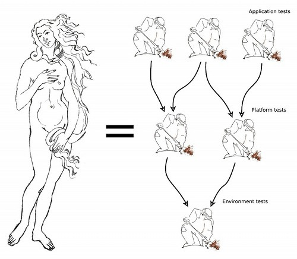
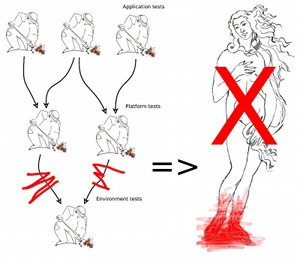

.. _system-conceptual-summary:

Conceptual Summary
==================

This document tries to explain the four major parts of AVE, what they are good
for and how they fit together.

Goals
-----
* Support for test anatomy.
* Asset management of test jobs.
* Solve generic issues with allocation and control of test lab equipment.
* Enable more precise tests that require detailed control over equipment.

Illustrations Legend
--------------------
A number of illustrations are used to symbolize the concepts and technologies
discussed in this document:

.. list-table::
   :widths: 10 90
   :header-rows: 1

   * - Illustration
     - Meaning

   * - .. image:: ../illustrations/git.icon.png
     - **Git**: This is the mascot of the Git SCM project.

   * - .. image:: ../illustrations/worker.icon.png
     - **Test Job**: A worker figure armed with a spade.

   * - .. image:: ../illustrations/builder.icon.png
     - **Build Job**: This was supposed to look like the vallet mascot of the
       Jenkins project.

   * - .. image:: ../illustrations/nascita.icon.png
     - **Test Anatomy**: Boticelli's classic painting "La Nascita di Venere",
       often used to symbolize anatomy.

   * - .. image:: ../illustrations/broker.icon.png
     - **Broker**: Performs allocation and reclamation of test lab equipment.

   * - .. image:: ../illustrations/workspace.icon.png
     - **Workspace**: Codifies test host properties and serves "scratch" space
       to test jobs.

   * - .. image:: ../illustrations/cradle.icon.png
     - **Cradle**: Used in the widest possible meaning of the word. "Cradles"
       may be power cycling fixtures used to force handsets into service mode,
       or relays to control USB connectivity of a tested device, etc.

   * - .. image:: ../illustrations/satellite.icon.png
     - **Network Simulator**: Faraday cages with e.g. faked GPS satellites
       inside.

Terminology
-----------

* **Test case**: Test cases execute on the device under test. Test cases are
  often written against *JUnit*or *gtest*. Test cases are stored in Git trees
  and are CM labeled together with the product.
* **Test job**: Test jobs execute on a test host. They drive the execution of
  test cases and are typically used as the smallest unit in test scheduling.

Test Anatomy
------------
So AVE uses Boticelli's "La Nascita di Venere" to symbolize anatomy, but what
is *test* anatomy?

Test anatomy establishes orders of execution for tests. The goal is usually to
execute simple tests before complex ones, to save time by skipping the complex
tests if the simpler ones fail. Another common goal is to order tests so that a
system's fundament is verified before features that depend on the fundament.

AVE supports test anatomy by using two concepts:

* Tagging. The ``.vcsjob`` interface for schedulers may select jobs in a Git
  tree by filtering on tags. Tag names may be controlled through governance so
  that a certain tag always signifies a certain scope level. E.g. "SMOKE" or
  "SANITY".
* Asset management: By only working with resources that have been stored in a
  common CM system, a scheduler may build dependency trees of assets. The root
  of the dependency tree might be a set of tests that verify AVE and the test
  environment itself. Once the test environment is verified, platform tests can
  be executed, followed by application tests.

CM Labeling of Test Jobs
------------------------
Before the dependencies between test jobs can be established, we must know which
test jobs are available. Each product should have a catalog that describes
the purpose of each test job written for the product. This is very similar to
writing documentation for an API, except the calls are made to jobs instead of
functions.

But there is a problem. The definition of a test job can escape cataloguing by
being stored outside centralized delivery systems. Jenkins jobs is an example
of this. Why? They are

* **Not version controlled**: Changes are effective immediately and with no
  easy way to back out of a bad one. Developers often create new jobs that are
  just small variations of existing ones to mitigate this risk. Older jobs get
  silently abandoned when they are no longer used.
* **Not asset managed**: Simply put, it is difficult to know what Jenkins jobs
  are used for, if anyone "owns" them (to use organization lingo), what steps
  are needed to migrate jobs between labs, or how to exchange jobs with external
  partners.

.. figure:: ../illustrations/jenkins_xor_assets.jpeg
   :align: center

Governance can't be based on something that loose. What we really want is to
use an existing CM system for labeling to create a reliable mapping between
jobs and their purposes:

.. figure:: ../illustrations/job_assets.jpeg
   :align: center

Requirements for Labeling
+++++++++++++++++++++++++
To be handled as source code artifacts in a CM system, the basic requirement on
test jobs is that they are written as proper programs, using API's designed for
this purpose.

Returning to the example of Jenkins jobs, please note that they are generated
from check boxes, selection menus and various input fields found in the
configuration console for each job. The stored form of this configuration is not
necessarily meant to be human readable and may take arbitrary forms that are not
suitable for Git or other patch based versioning systems. As long as test jobs
*are* Jenkins jobs, we can't have asset management on the jobs and thus no test
anatomy.

.. figure :: ../illustrations/jenkins_xor_anatomy.jpeg
   :align: center

.. note:: Jenkins is a tremendously useful tool. It is just that it should not
   be used to *directly* represent test jobs.

Course of Action
++++++++++++++++
* We need API's that test jobs use to configure themselves,
* so that test jobs can be written as proper programs,
* so that test jobs can be CM labeled,
* so that test jobs can be asset managed,
* so that test anatomy can be implemented.

Alright? So everything hinges on some collection of API's designed for test job
configuration. What are these API's?

* **Workspace API's**: A test job needs some "scratch" space to store artifacts
  from the build system, C2D packages, etc. A workspace API must also be able
  to answer queries about the test host. E.g. if there is a WLAN in the lab
  and how to connect to it.
* **Broker API's**: Most test jobs need to allocate handsets and sometimes other
  kinds of test lab equipment. The resources are allocated by a "broker".
* **Equipment API's**: The broker returns resource handles for handsets, relays,
  positioning equipment, power meters, etc. All of these must be controllable
  by the test job.
* **Anatomy API's**: Developers should be able to browse the global catalog of
  test jobs, pick useful dependencies from it and refer to them from their own
  test jobs.
* **Reporting API's**: It should be easy and convenient to report test results
  against a well defined configuration of the product.

Allocation & Control of Test Equipment
--------------------------------------
As mentioned, we need test job API's for brokers and resources, to support
allocation and control of equipment.

Broker Basics
+++++++++++++
The broker is a networked service that is installed on each test host. It owns
all equipment connected to the host and uses a host specific configuration to
keep track of how different pieces of equipment can be combined. It presents an
API that test jobs use to allocate "stacks" of equipment.

An advanced example would be a handset whose battery connection is controlled
by a relay and monitored by a power meter, on a test host that has a unique
tool installed.

.. figure:: ../illustrations/broker_with_equipment.png
   :align: center

Broker Configuration
++++++++++++++++++++
AVE lets lab owners control the host specific configuration details that are
unique to each lab, while the test job developer controls only the job specific
configuration details. This gives lab owners a governed space that only they
control, which is important for lab development and maintenance. It also
facilitates exchange of test jobs between labs because the jobs only use well
defined API's to query the host specific configurations.

Distributed and Centralized
+++++++++++++++++++++++++++
The networking of the broker means that test jobs can be executed on one host,
while all equipment manipulation happens on another host (where the broker is
running). This lets developers execute test jobs manually on their own
workstations during test job development.

The system is designed with lab owners in mind. It must be easy to cluster a
couple of brokers and give test job developers directions for how to connect to
the lab. Of course, individual developers can also use this to set up their own
miniature labs on their workstations. All you need is the broker and some
equipment.

Broker Goals
++++++++++++
* Make it cost effective to set up centralized labs that offer load balanced
  access to large equipment parks.
* Allow people to work in a decentralized, distributed fashion where they can
  control a private lab in minute detail.
* Govern the broker API's so that job schedulers can freely choose whether to
  run a job against a private lab or a centralized one.

Advanced Equipment State Tracking
---------------------------------
Test jobs need to track the state of equipment. On the very low level, this is
about power cycling handsets in and out of service mode. On the very high level,
this is about coordination of multiple pieces of equipment.

Low Level
+++++++++
Most equipment is not hard to control once the allocation mechanism is in place
but SoMC's own handsets make an exception. Why? Because they have two properties
that are frequently in conflict:

* They are unstable during development. This is just the way it is with new
  products.
* They are part of the verification environment and as such are expected to
  "just work".

Especially, the handset's ability to power cycle between service mode and normal
Android mode is critical. Unstable handsets can easily be lost at this boundary
and end up in a "draining state" where they have to be manually recovered. This
has consequences for test automation:

* Brokers can't use equipment that do not work well enough to support their own
  testability. E.g. the handset is caught in a boot crash loop and there is no
  way of figuring this out by asking it.
* Lack of control over misbehaving equipment means that fine grained test can't
  be written against some forms of power cycling. Because handsets are part of
  the test environment, this means that a crucial aspect of the environment is
  itself untestable.
* The root in the test anatomy should verify the environment before allowing
  other tests to execute. If such a test cannot reliably recover bad product
  configuations, then we must expect lab owners to spend much time baby sitting
  their handsets.

To handle this, three things should be done:

* The product must support its own recoverability. This should include purely
  electrical means of bringing the product into a state where it accepts a new
  configuration for flashing. SONY handsets support this by changing its boot
  sequence if extra electrical resistence is detected on the USB connection.
* The lab must stack the products together with trusted auxiliary equipment that
  can be used to exploit the product's recoverability. E.g. relays that control
  the battery connection to force cold boots.
* Fine control over many aspects of power cycling must be exposed as API's so
  that a failing test can pinpoint exactly where and how power cycling failed.
  E.g. a RAM dumping handset does not expose any USB device descriptor and is
  indistinguishable from a physically disconnected handset.

High Level
++++++++++
Product often do not expose API's to tell developers what is going on inside.
Android in particular does not have many testability API's. AVE solves this by
shipping various support APK's that can be installed during testing. Such APK's
can implement missing testability API's.

Another problem is that system testing is often not meaningful if the product
is the only available observer of itself. The list of auxiliary equipment needed
for different kinds of system tests can be made very long:

* Companion products
* Relays
* Power meters
* MHL/HDMI sniffers
* High speed cameras
* Microphones
* Network simulators
* etc

A Strategy Against Waste
------------------------
AVE is designed to support processes and strategies that significantly improve
the ability to track progress in product projects:

* Tests that have no expectation to pass should be skipped automatically when
  dependencies fail. This helps developers avoid wasteful root cause analysis.
* The verification environment itself becomes testable, which can be used to
  write exit criteria for platform and cookie bring-up.
* Test jobs can be developed, delivered and deployed with the same efficiency
  and CM rigor as the rest of the product.
* Branching of products and their tests is done in the same CM environment.
* Test jobs can reliably be migrated between various lab environments. E.g.
  from a centralized one to a "satelite lab" with access to real operator
  networks.
