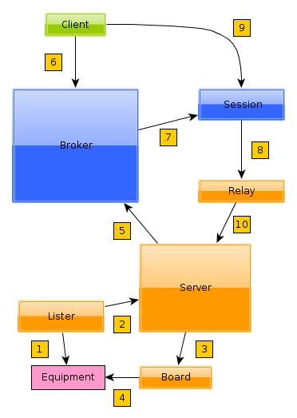

Relay Server
============

Overview
--------

The relay server is implemented as a stand-alone subsystem whose life cycle is
independent of the broker and its sessions. The basic concept is to map single
boards to multiple virtual relays so that a single board may serve multiple test
jobs concurrently.

The schematic view to the right shows the most common steps that are involved in
detection and allocation of relays. Colors are used to show which items belong
to the same AVE component.

 #. Detect equipment
 #. Report a board profile to the relay server
 #. Create a representation of the equipment
 #. Claim the equipment
 #. Report virtualized relay profiles to the broker
 #. Client tries to allocate a relay
 #. Allocate one of the virtual relays and pass its profile to the client's
    session.
 #. Create a resource representation from the allocated profile
 #. Ask session to manipulate a virtual relay circuit
 #. Tell the server to manipulate the corresponding physical relay circuit

Requirements
------------
 * Broker support for detection, allocation and reclamation of the relay to
   sessions.
 * Broker support for grouping of relay ports into virtual devices that can be
   paired with e.g. handsets.
 * The broker must be able to reset the relay to a default state if it was
   allocated to a job which has subsequently lost control over it.
 * All functions that exercise relays should operate on identities that can be
   guaranteed to never change in a given test lab.
 * Static configuration files must be used to group relay circuits into logical
   units that can be paired with handsets.
 * It must be possible to restart the system without affecting active clients.

Equipment Detection
-------------------
Generally, detection cannot be based on dynamically created OS representations,
such as device nodes or sysfs paths. These change when the equipment is plugged
into a different USB port and may depend on order the OS enumerates equipment.
Instead use a persistent property of the equipment itself. E.g. serial numbers.
 
Devantech
^^^^^^^^^
Devantech relays have unique serial numbers and can be detected reliably with
``udev`` event handling. The device appears in the sysfs tree, which lets the
system find the device node (``/dev/ttyACM[0..7]``) and open it.

Equipment Allocation
--------------------
Some observations:

 * Only one process on the host can claim any given board.
 * Test jobs operate through sessions that are running as independent processes.
   This means the sessions must not claim the boards directly as that makes it
   impossible to share one board's circuits among multiple test jobs. The
   sessions must instead use a multiplexing server.

Virtualization
^^^^^^^^^^^^^^
To share many board circuits among many sessions, allocation should be based on
logical groupings of circuits. These groupings must have unique identifiers that
persist over system restarts and power cycling of the physical relay boards.

See the API documentation for example configuration of virtual relays.

Equipment Reclamation
---------------------
Because the sessions do not get direct control over physical boards, it is
enough for the broker to reset allocated relays to their default states when a
session terminates.

Implementation
--------------
All modules are found in the ``ave.relay`` Python name space.

``board.Board``
^^^^^^^^^^^^^^^
A factory class that creates ``DevantechBoard`` instances.

The server uses a board profile (provided by the equipment lister) to create
board objects. The profile determines what the factory class produces. The
configuration of the board is determinated by vendor-specific configuration
files:

 * Devantech: ``.ave/config/devantech.json``

See the API documentation for details about these files.

``config``
^^^^^^^^^^
Helper functions that validate configuration files for the relay server and the
board configurations. Used by ``server.RelayServer``.

``daemon.RelayServerDaemon``
^^^^^^^^^^^^^^^^^^^^^^^^^^^^
A class that performs daemonization of a relay server. Used by the CLI tool
``ave-relay``.

Creates log and PID files in ``/var/tmp/ave-relay.{log,pid}``.

``devantech.DevantechBoard``
^^^^^^^^^^^^^^^^^^^^^^^^^^^^
Class that represents a physical Devantech relay board. Attempts to load the
file ``.ave/config/devantech.json`` on instantiation. If this is successful, it
also claims the board by opening its device node. The class implements functions
to set and reset physical circuits on the board. It also tracks the states of
all circuits.

``exceptions.DeviceOffline``
^^^^^^^^^^^^^^^^^^^^^^^^^^^^
Exception used internally in the server to handle situations where a board has
gone offline since the last manipulation of the board.

``lister.BoardLister``
^^^^^^^^^^^^^^^^^^^^^^
Uses ``libudev`` to list USB equipment with known vendor and product ID's. When
a board is plugged in (or listed at server startup) a profile of the board is
generated and sent to the relay server. Example profile::

    {
        "product": "usb-rly16l", 
        "vendor": "devantech", 
        "power_state": "online", 
        "serial": "00014007", 
        "type": "board", 
        "sysfs_path": "/sys/devices/pci0000:00/0000:00:1d.7/usb2/2-4/2-4.1/2-4.1.4", 
        "device_node": "/dev/ttyACM0"
    }

Internally, the lister maps the sysfs path to the profile. If the equipment is
later disconnected, ``libudev`` only lists the sysfs path but we need the serial
number when telling the server that a particular board went offline.

Python 2 does not provide a standard library to interface with ``libudev`` so
the ``ctypes`` module is used to load the native library directly.

``profile.BoardProfile``
^^^^^^^^^^^^^^^^^^^^^^^^
Created by the lister and consumed by the server. Visible to administrative
clients that call ``RelayServer.list_equipment()``.

``profile.RelayProfile``
^^^^^^^^^^^^^^^^^^^^^^^^
Created by the server and consumed by the broker. Matched against allocation
attempts in the broker. Visible to the client after successful allocation.
Visible to administrative clients that call ``RelayServer.list_virtual()`` or
``Broker.list_equipment({'type':'relay'})``.

``reporter.Reporter``
^^^^^^^^^^^^^^^^^^^^^
A daemonizing process that is used to periodically report virtual relays to the
broker. The reporting is performed in a separate process to make sure that e.g.
network problems do not stall the relay server main loop. The daemonization
frees the server main loop from explicitly waiting for the process to exit.

``resource.Relay``
^^^^^^^^^^^^^^^^^^
The equipment class used by broker sessions. It is implemented as a subclass of
``RemoteRelayServer`` and uses the allocated relay profile to tell the relay
server which virtual relay it wants to manipulate.

``server.RelayServer``
^^^^^^^^^^^^^^^^^^^^^^
Inherits from ``ave.network.control.Control``. Implements the server main loop.
It starts the lister, turns board profiles into virtual relay profiles and
periodically reports these to the broker.

``server.RemoteRelayServer``
^^^^^^^^^^^^^^^^^^^^^^^^^^^^
Inherits from ``ave.network.control.RemoteControl``. Administrative clients
should use this class to connect and run functions on the server. Broker
sessions should use ``resource.Relay``. Other clients should not do any calls
directly to the relay server (and will anyway not be able to do much without
administrative privileges).

``bin/ave-relay``
^^^^^^^^^^^^^^^^^
Supports starting, restarting and stopping the relay server. Only implements
command line parsing. The rest is implemented in ``RelayServerDaemon``.

Restarting the Server
---------------------
The server constructor function accepts a list of board profiles. When this is
set, a detected board is not reset to its default state. Instead the server just
inherits the board state passed to the constructor. Detected boards that do not
appear in the list of inherited board profiles are reset.

The server hands over execution to a new instance serializes its board states
and stops listening for new connections. The serialized state will not include
boards that have gone offline.

Clients that are connected to the old instance will receive ``Restarting``
exceptions on their next attempt to manipulate a relay. This is caught by the
``Relay`` resource class which then connects to the new server instance and
retries the manipulation. This hides server restarts from all non-administrative
clients.

Configuration Files
-------------------
The board-specific configuration files should not be changed while the server
is running as this may create virtual relay configurations that overlap with
the configurations that connected clients are already using.

If an entirely new board is to be connected to the host, it is recommended to
write its configuration file before connecting it (if the server is used in a
live lab with active clients).
